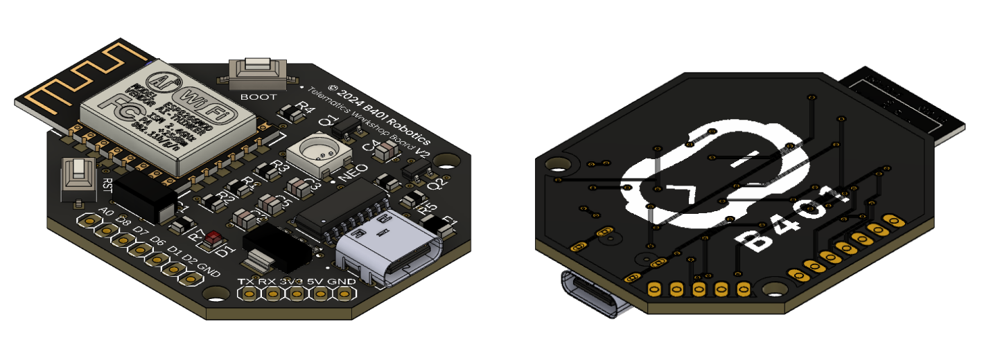

<!-- center -->
<h1 align="center">Telematics Workshop Board</h1>

	</a>
	</a>
	</a>

This repository contains the documentation for the Workshop Telematics Board. The board is based on the ESP8266 microcontroller and has several features that can be used for various projects.

<!-- beritahu versi lawas -->
> For the previous version of the board, refer to the [v1 board.](https://github.com/b401-robotics/esp8266-minsys)

## 🌟 Features

The following are the features available on this board.

- ESP-12F (ESP8266)
- 8 GPIO Pins
- Programmable RGB LED
- Overcurrent Protection
- USB Type-C Connector (_Power Delivery Support_) 

## 👀 Preview

Here is a preview of the board that will be used in the workshop.

## 📚 Resources

For more information about the board, you can check the following resources.

- [Hardware](hardware/)
- [Firmware](firmware/)

## 🔮 Project Showcase

Discover projects that use this board in various applications and contexts.

- [🌌 __COMING SOON__]() by [farisrfp](https://farisrfp.me)

## 📝 License

Distributed under the MIT License. See `LICENSE` for more information.