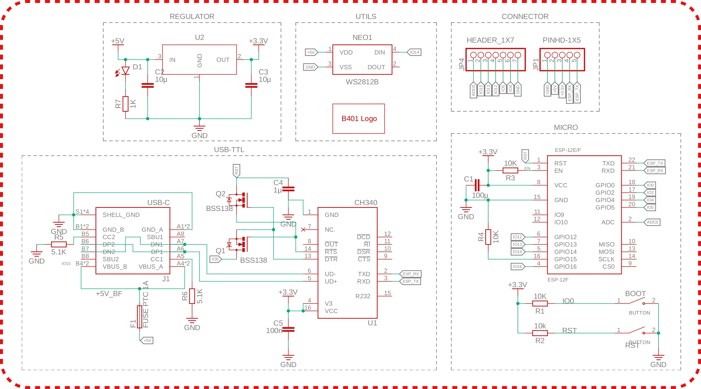
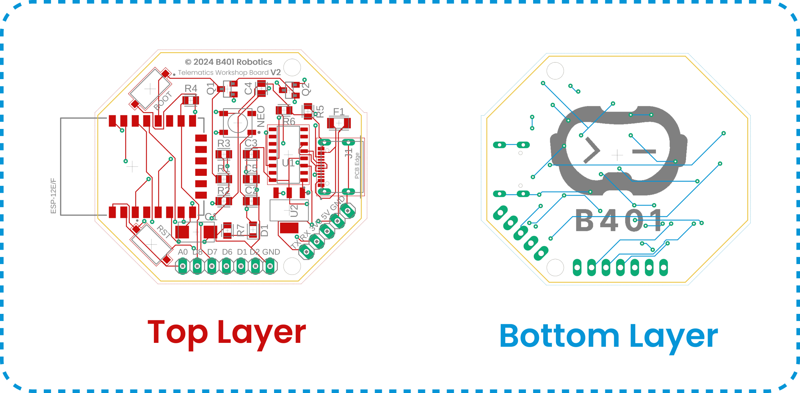
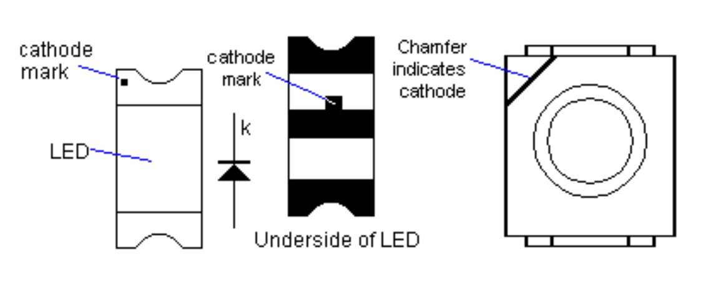
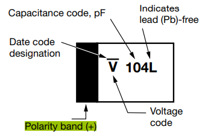

# **Hardware**

This folder contains the hardware design for the Telematics Workshop Board.

## 🚀 Getting Started

### Prerequisites

- [Eagle](https://www.autodesk.com/products/eagle/overview) 
- [Fusion 360](https://www.autodesk.com/products/fusion-360/overview)

## 🕸 Schematic

This is the schematic diagram for the Board will be used in the workshop.

## 💲 Bill of Material

|   Designator   | Quantity | Package  | Value  |      Description      |
|:--------------:|:--------:|:--------:|:------:|:---------------------:|
|    ESP-12F     |    1     |    -     |   -    |    ESP8266 Module     |
|       U1       |    1     |  SOP-16  | CH340C |    IC USB to UART     |
|       U2       |    1     | SOT-223  |  3V3   | Voltage Regulator 3V3 |
|       D1       |    1     |   0805   |  Red   |          LED          |
|      NEO       |    1     |   5050   |  RGB   |        WS2812B        |
|       F1       |    1     |   1206   | 750mA  |    Resettable Fuse    |
|       J1       |    1     |    -     |  16P   |      USB Type-C       |
|   BOOT, RST    |    2     |    -     |   -    |      Push Button      |
| R1, R2, R3, R4 |    4     |   0805   |  10K   |       Resistor        |
|     R5, R6     |    2     |   0805   |  5.1K  |       Resistor        |
|       R7       |    1     |   0805   |   1K   |       Resistor        |
|       C1       |    1     |   2412   |  100u  |   Capacitor (Polar)   |
|     C2, C3     |    2     |   0805   |  10u   | Capacitor (Nonpolar)  |
|       C4       |    1     |   0805   |   1u   | Capacitor (Nonpolar)  |
|       C5       |    1     |   0805   |  10n   | Capacitor (Nonpolar)  |
|     Q1, Q2     |    2     |  SOT-23  | BSS138 |   N-Channel MOSFET    |

## 👨‍🔧 PCB Assembly

Refer to the image below for detailed placement and routing.

> Click the image to view the full resolution.

### SMD Polarity

SMD LEDs have 2 pins, namely the anode and cathode pins. Refer to the image below to determine which pin is the anode and cathode.

The Tantalum Capacitor is one of the polar capacitors. Refer to the image below to determine which pin is the anode(+).

## 📚 Resources

### Telematics Workshop Board

Access the design files for the Telematics Workshop Board directly from this repository:

- [Schematic](./telematics_board_v2.sch)
- [Board Design](./telematics_board_v2.brd)
- [3D Model](./telematics_board_v2.step)
- [Eagle/Fusion 360 Library](libraries/)

### Enclosure

Access the 3D printable enclosure files from this repository, with contributions from the following individuals:

- [B401 Robotics]()

<!-- ## SMD Polarity

